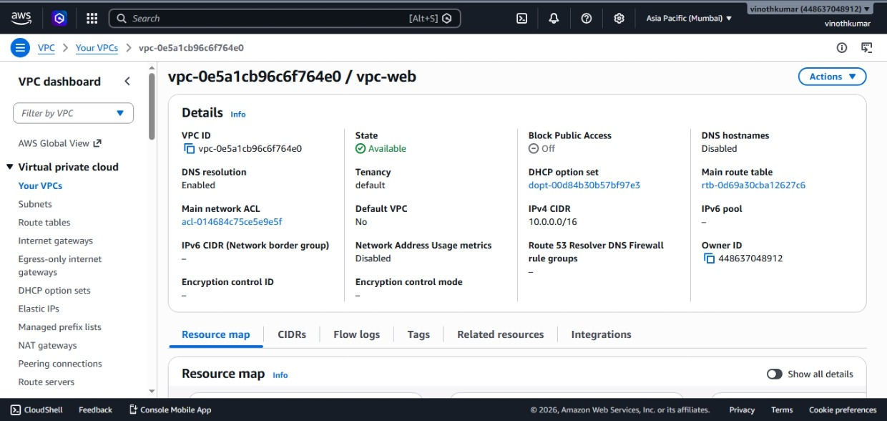
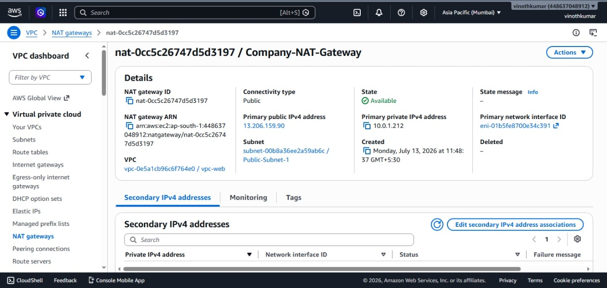

# AWS 3-Tier Web Application

## Project Overview
This project demonstrates a simple AWS 3-Tier Web Application deployed using AWS Free Tier services.

## Technologies Used
- Amazon VPC
- Public & Private Subnets
- Internet Gateway
- NAT Gateway
- Route Tables
- Security Groups
- Amazon EC2 (Amazon Linux 2023)
- Apache Web Server
- Python Flask
- Amazon RDS MySQL

## Project Features
- Custom VPC
- Public and Private Subnets
- Secure Security Groups
- Apache Web Server Hosting
- Flask Web Application
- MySQL Database Connectivity
- Dynamic User Data Display

## Architecture

m here)

## Screenshots

## Screenshots

### VPC Overview

### AWS Console Screenshots

## Author

Vinoth Kumar
(Add screenshots here)

## Author

Vinoth Kumar
